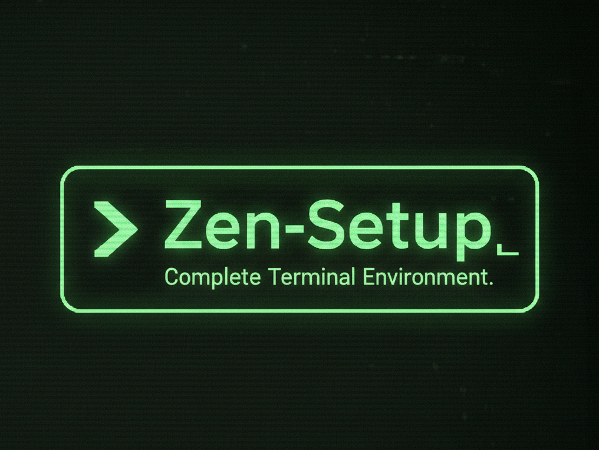

<p align="center">
  
</p>

<p align="center">
  <strong>One command. Complete terminal. Perfect harmony.</strong>
</p>

<p align="center">
  
  
  <a href="https://deepwiki.com/Ankur-singh/zen-setup"></a>
</p>

<p align="center">
  Transform any macOS or Linux system into a beautiful, productive development environment in minutes.
</p>

---

**Zen (全)** - meaning "complete" or "all" in Japanese - provides everything you need for a perfect terminal experience.

## 📖 Table of Contents

- [Why Zen?](#-why-zen)
- [Quick Start](#-quick-start)
- [Features](#-features)
- [What Gets Installed](#-what-gets-installed)
- [Who Is This For?](#-who-is-this-for)
- [Performance](#-performance)
- [Documentation](#-documentation)
- [FAQ](#-faq)
- [License](#-license)

## 🤔 Why Zen?

**The Problem:**
Setting up a new dev machine takes hours of manual configuration. Googling commands, installing tools one by one, configuring dotfiles, fixing PATH issues... It's tedious and error-prone. Syncing configs across multiple machines? Even worse.

**The Solution:**
Zen provides a single, tested, reproducible setup that transforms a fresh system into a complete development environment with one command.

**Why Choose Zen:**
- ✨ **Works identically** on macOS and Linux
- 🐚 **Platform-native shells** - Zsh on macOS, Bash on Linux
- 🚀 **Installs in ~5 minutes** with one command
- 🔄 **Updates easily** with `zupdate`
- 🎯 **Includes 50+ curated tools** and configurations
- 📦 **Deploy to unlimited** remote servers
- 🛡️ **Safe and reversible** - backs up everything
- 🧩 **Modular** - install only what you need

## 🚀 Quick Start

### Installation

```bash
curl -fsSL https://raw.githubusercontent.com/Ankur-singh/zen-setup/main/install.sh | bash
```

That's it! Grab a coffee while it installs (~5 minutes).

### Installation Options

```bash
# Full setup (default) - everything included
curl ... | bash

# Minimal setup - no neovim, no docker
curl ... | bash -s -- --minimal

# Interactive - choose what to install
curl ... | bash -s -- --interactive
```

| Profile | What's Included |
|---------|-----------------|
| Default | Shell, CLI tools, tmux, neovim, git, docker, python |
| `--minimal` | Shell, CLI tools, tmux, git, python *(no neovim, docker)* |

### First Commands After Install

```bash
zhelp      # See all available commands
zdoctor    # Health check your installation
lzg        # Try LazyGit (visual git interface)
ff         # Fuzzy find files with preview
nvim       # Open Neovim with LazyVim
btop       # Beautiful system monitor
```

<details>
<summary><b>Manual installation</b></summary>

### Clone and Customize

```bash
git clone https://github.com/Ankur-singh/zen-setup.git ~/.local/share/zen-setup
cd ~/.local/share/zen-setup

# Customize variables (optional)
nvim vars/common.yml

# Install
./bootstrap.sh              # Full setup (default)
./bootstrap.sh --minimal    # Minimal (no neovim, docker)
./bootstrap.sh --interactive # Choose components
./bootstrap.sh --dry-run    # Preview what will install
```

### Advanced Options

See [docs/INSTALLATION.md](docs/INSTALLATION.md) for:
- Remote VM deployment
- Selective installation with tags
- Custom install locations

For developers: see [docs/DEVELOPMENT.md](docs/DEVELOPMENT.md) for Makefile commands and Ansible usage.

</details>

## ⚡ Features at a Glance

### Before & After Comparison

| Feature | Before Zen | After Zen |
|---------|-----------|-----------|
| File listing | `ls` (basic) | `eza` (icons, git status, tree view) |
| File search | `find` (slow) | `fd` + `fzf` (instant, fuzzy search) |
| Text search | `grep` | `ripgrep` (10x faster) |
| Git workflow | Manual CLI typing | `lazygit` (beautiful visual TUI) |
| Directory nav | `cd ../../..` | `z` (smart jump to frequent dirs) |
| View files | `cat` | `bat` (syntax highlighting) |
| Process monitor | `top` (basic) | `btop` (beautiful, interactive) |
| Docker mgmt | Manual commands | `lazydocker` (visual TUI) |

### Core Components

| Component | What You Get |
|-----------|-------------|
| **Shell** | **Zsh** (macOS) / **Bash** (Linux) with syntax highlighting, autosuggestions, 50+ aliases, 30+ functions |
| **CLI Tools** | 15+ modern tools: eza, bat, fzf, zoxide, ripgrep, fd, lazygit, btop, fastfetch |
| **Tmux** | Pre-configured with 6 plugins, custom keybindings, session persistence |
| **Neovim** | LazyVim with LSP, treesitter, auto-completion, beautiful UI |
| **Git** | GitHub CLI, useful aliases, git-delta for beautiful diffs, lumen *(macOS only)* |
| **Docker** | Engine + Compose, user in docker group, BuildKit enabled |
| **Python** | UV package manager (100x faster than pip), Python 3.12 |
| **NVIDIA** | GPU drivers + CUDA Toolkit + Container Toolkit for ML/AI *(Linux only)* |

### Platform-Specific Features

| Feature | macOS | Linux |
|---------|:-----:|:-----:|
| Shell | Zsh | Bash |
| git-delta (beautiful diffs) | Yes | Yes |
| lumen (AI-powered diffs) | Yes | - |
| NVIDIA GPU support | - | Yes |
| ble.sh (bash enhancements) | - | Yes |

### What Makes Zen Different

- ✅ **Cross-platform**: Single playbook works on macOS and Linux
- ✅ **Remote-ready**: Deploy to unlimited VMs from inventory
- ✅ **Idempotent**: Safe to run multiple times
- ✅ **Modular**: Install everything or pick components with tags
- ✅ **Customizable**: Variables for easy configuration
- ✅ **Terminal-only**: No desktop apps, perfect for servers and SSH
- ✅ **Smart updates**: `zupdate` keeps everything current
- ✅ **Backup-safe**: All configs backed up before changes

## 📦 What Gets Installed

<details>
<summary><b>Shell Configuration</b></summary>

**Platform-native shells:**
| Platform | Shell | Config File |
|----------|-------|-------------|
| macOS | Zsh | `~/.zshrc` |
| Linux | Bash | `~/.bashrc` |

**Features:**
- Custom prompt with git integration
- Optional [Starship](https://starship.rs/) prompt support
- 50+ useful aliases (shared across platforms)
- 30+ helpful functions (shared across platforms)
- Zsh plugins: autosuggestions, syntax-highlighting, completions (macOS)
- Bash enhancements: ble.sh for syntax-highlighting + autosuggestions (Linux)
- Better readline configuration (inputrc for bash)

</details>

<details>
<summary><b>Modern CLI Tools</b></summary>

| Tool | Purpose | Replaces |
|------|---------|----------|
| **eza** | Modern ls with icons | ls |
| **bat** | Syntax highlighting cat | cat |
| **fzf** | Fuzzy finder | grep/find |
| **zoxide** | Smart directory jumper | cd |
| **ripgrep** | Fast recursive search | grep |
| **fd** | Fast file finder | find |
| **lazygit** | Terminal UI for git | - |
| **lazydocker** | Terminal UI for docker | - |
| **btop** | Beautiful process monitor | top/htop |
| **fastfetch** | System info display | neofetch |
| **git-delta** | Beautiful git diffs | diff |
| **lumen** | AI-powered diff tool *(macOS only)* | diff |

Plus: jq, tree, tldr, and more!

</details>

<details>
<summary><b>Tmux Setup</b></summary>

**Prefix:** `Ctrl-a` (instead of default Ctrl-b)

**Plugins:**
- TPM (Plugin Manager)
- tmux-sensible (sensible defaults)
- tmux-resurrect (save/restore sessions)
- tmux-continuum (auto-save sessions)
- tmux-yank (better copy/paste)
- vim-tmux-navigator (seamless vim/tmux navigation)

**Key Bindings:**
- `Prefix + |` - Split horizontally
- `Prefix + -` - Split vertically
- `Prefix + r` - Reload config
- `Alt + Arrow` - Switch panes (no prefix!)
- `Shift + Arrow` - Switch windows (no prefix!)

</details>

<details>
<summary><b>Neovim with LazyVim</b></summary>

- LSP support for multiple languages
- Treesitter for better syntax highlighting
- Auto-completion
- File explorer, fuzzy finder, git integration
- Beautiful UI with modern theme

**Key Bindings:**
- `Space` - Leader key (shows menu)
- `:Lazy` - Plugin manager
- `:Mason` - LSP/formatter installer

</details>

<details>
<summary><b>Docker</b></summary>

- Docker Engine with BuildKit
- Docker Compose (v2)
- User added to docker group (no sudo needed)
- Log rotation configured

</details>

<details>
<summary><b>NVIDIA GPU Support (Linux only, optional)</b></summary>

> **Note:** NVIDIA support is only available on Linux (Ubuntu/Debian). It is automatically skipped on macOS.

- NVIDIA drivers (auto-detected or specific version)
- NVIDIA CUDA Toolkit (nvcc compiler and libraries)
- NVIDIA utilities (nvidia-settings, nvidia-prime)
- NVIDIA Container Toolkit (only installed if Docker is present)
- Docker configured with GPU runtime

**Enable with:**
```bash
# In vars/common.yml, set:
install_nvidia: true
```

See [NVIDIA Setup Guide](docs/INSTALLATION.md#nvidia-gpu-support) for details.

</details>

<details>
<summary><b>Python with UV</b></summary>

- UV package manager (100x faster than pip)
- Python 3.12 by default
- Virtualenv support

**Common commands:**
```bash
uv venv                 # Create virtual environment
uv pip install <pkg>    # Install package
venv                    # Create and activate venv (function)
```

</details>

## 👥 Who Is This For?

### ✅ You Should Use Zen If:
- Want a modern terminal experience out of the box
- Manage multiple dev machines (local + remote)
- Work primarily in the terminal
- Want reproducible, version-controlled configs
- Need to onboard team members quickly
- Love productive, beautiful tools
- Prefer terminal-only workflows (servers, SSH)

### ⚠️ Maybe Not For You If:
- Prefer GUI applications over terminal
- Want to learn by configuring everything manually from scratch
- Use Windows (WSL might work, but not officially tested)
- Already have a heavily customized setup you're deeply attached to
- Don't want Ansible managing your configs


## 🔄 Updating

Use the built-in `zupdate` command:

```bash
# Update everything
zupdate

# Update specific components
zupdate shell
zupdate "shell,cli-tools"
```

**Features:**
- Auto-detects Zen directory
- Stops if already up to date (no unnecessary reinstalls)
- Platform-aware (handles macOS/Linux differences)
- Shows what changed

See [Update Guide](docs/INSTALLATION.md#updating) for details.

## 📚 Documentation

- **[Installation Guide](docs/INSTALLATION.md)** - Detailed install options, remote deployment
- **[Commands Reference](docs/COMMANDS.md)** - Complete command list and usage
- **[Customization Guide](docs/CUSTOMIZATION.md)** - Variables, tags, local configs
- **[Troubleshooting](docs/TROUBLESHOOTING.md)** - Common issues and solutions
- **[Features Overview](FEATURES.md)** - Quick feature reference
- **[Starship Prompt](docs/STARSHIP.md)** - Starship configuration guide

## ❓ FAQ

<details>
<summary><b>Can I use this on my remote servers?</b></summary>

Yes! Add them to `inventory.yml` and deploy with Ansible. Perfect for managing multiple servers with identical configurations.

```bash
# Add to inventory.yml
remote_vms:
  hosts:
    vm1:
      ansible_host: 192.168.1.100
      ansible_user: ubuntu

# Deploy
ansible-playbook playbook.yml --limit remote_vms
```
</details>

<details>
<summary><b>Will this override my existing configs?</b></summary>

All existing configs are automatically backed up with timestamps before any changes:
- `~/.bashrc` → `~/.bashrc.backup.YYYYMMDD_HHMMSS`
- `~/.zshrc` → `~/.zshrc.backup.YYYYMMDD_HHMMSS`
- `~/.tmux.conf` → `~/.tmux.conf.backup.YYYYMMDD_HHMMSS`
- `~/.config/nvim/` → `~/.config/nvim.backup.YYYYMMDD_HHMMSS`

You can restore anytime or clean up with `zcleanup`.
</details>

<details>
<summary><b>Can I customize what gets installed?</b></summary>

Absolutely! Several ways:

1. **Edit variables** before installing (`vars/common.yml`)
2. **Use tags** to install specific components:
   ```bash
   ansible-playbook playbook.yml --tags "shell,cli-tools"
   ```
3. **Use make targets** for selective installation:
   ```bash
   make install-shell
   make install-docker
   ```

See [Customization Guide](docs/CUSTOMIZATION.md) for details.
</details>

<details>
<summary><b>How do I uninstall?</b></summary>

1. **Restore backups:**
   ```bash
   cp ~/.zshrc.backup.YYYYMMDD_HHMMSS ~/.zshrc
   cp ~/.config/nvim.backup.YYYYMMDD_HHMMSS ~/.config/nvim -r
   ```

2. **Remove installed tools** (optional - they won't hurt):
   ```bash
   # macOS
   brew uninstall eza bat fzf ...
   
   # Linux
   sudo apt remove eza bat ...
   ```

3. **Clean up backups:**
   ```bash
   zcleanup --force
   ```
</details>

<details>
<summary><b>Does this work on WSL (Windows)?</b></summary>

Not officially tested, but it should work on WSL2 with Ubuntu. Follow the Linux installation instructions.
</details>

<details>
<summary><b>Why Zsh on macOS and Bash on Linux?</b></summary>

Zen uses the **platform-native default shell** for each OS:
- **macOS**: Zsh has been the default since Catalina (2019)
- **Linux**: Bash is the default on Ubuntu/Debian

This simplifies the codebase and matches what 95%+ of users already have. Both shells get the same aliases, functions, and features (syntax highlighting, autosuggestions).
</details>

<details>
<summary><b>Can I use this with Starship prompt?</b></summary>

Yes! Set `use_starship_prompt: true` in `vars/common.yml` before installing. See [Starship Guide](docs/STARSHIP.md).
</details>

<details>
<summary><b>Will this work with my existing tmux/vim setup?</b></summary>

Your existing configs are backed up first. Zen installs LazyVim (a Neovim distribution) and a custom tmux config. You can switch back to your backups anytime.
</details>

<details>
<summary><b>How do I update Zen?</b></summary>

Simply run:
```bash
zupdate
```

It auto-detects the installation location, pulls updates, and only reinstalls if there are changes.
</details>

<details>
<summary><b>What if something breaks?</b></summary>

1. **Restore from backups** (all configs are backed up)
2. **Check troubleshooting** - [docs/TROUBLESHOOTING.md](docs/TROUBLESHOOTING.md)
3. **File an issue** - https://github.com/Ankur-singh/zen-setup/issues

The playbook is idempotent, so you can safely re-run it anytime.
</details>


## 📖 Quick Command Reference

### Most Common Commands

```bash
# Navigation
z <name>    # Jump to directory
ff          # Fuzzy find files
..          # Go up one directory

# Git
lzg         # LazyGit (visual interface)
gs          # git status
gcm "msg"   # git commit -m

# Docker
lzd         # LazyDocker (visual interface)
dps         # docker ps
denter <id> # Enter container

# Files
ls, ll, lt  # Modern file listing
cat <file>  # Syntax-highlighted cat (bat)
search "x"  # Fast text search (ripgrep)

# System
btop        # System monitor
myip        # Show public IP (copies to clipboard)
localip     # Show local IP (copies to clipboard)

# Zen Management
zhelp       # Show all commands
zupdate     # Update Zen
zdoctor     # Health check installation
zsetup      # Run setup again
zcleanup    # Clean backup files
```

For complete reference, see [docs/COMMANDS.md](docs/COMMANDS.md) or run `zhelp`.

## 🔧 Quick Troubleshooting

### Common Issues

**Docker permission denied?**
```bash
newgrp docker
# Or log out and back in
```

**Shell changes not applied?**
```bash
source ~/.zshrc  # macOS
source ~/.bashrc # Linux
```

**Neovim plugins not loading?**
```bash
nvim
# Press: Space → Lazy → I (install)
```

For more solutions, see [docs/TROUBLESHOOTING.md](docs/TROUBLESHOOTING.md).

## 📝 License

MIT License - feel free to use and modify as needed.

## 🙏 Acknowledgments

- Inspired by [Omakub](https://github.com/basecamp/omakub) by DHH
- Built with [Ansible](https://www.ansible.com/)
- Uses [LazyVim](https://www.lazyvim.org/) for Neovim configuration
- Powered by modern CLI tools from the open-source community

---

<p align="center">
  <b>🧘 Achieve terminal zen.</b><br>
  <sub>Made with ❤️ for terminal enthusiasts</sub>
</p>

<p align="center">
  <a href="https://github.com/Ankur-singh/zen-setup/stargazers">⭐ Star this repo if you find it useful!</a>
</p>
